

<!-- omit from toc -->
# Awesome Communities 

A curated list of awesome communities, and community programs.

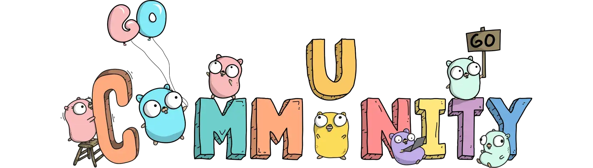

[GoCommunity](https://github.com/ashleymcnamara/gophers/blob/master/GoCommunity.png) by [Ashley Willis](https://github.com/ashleymcnamara) is licensed under [CC BY 4.0](http://creativecommons.org/licenses/by/4.0/)

<!-- omit from toc -->
## Contents

- [Communities](#communities)
- [Community Programs](#community-programs)

## Communities

[__AUSG__ (AWSKRUG University Student Group)](https://ausg.me) \
 A cloud community for university student developers that shares experience with each other. \
`#south-korea`, `#aws`, `#cloud`, `#university`

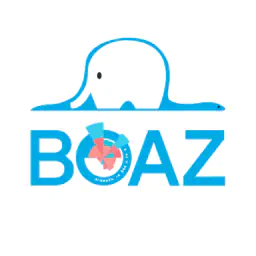

[__BOAZ__](https://www.bigdataboaz.com/) \
 Korea’s first university student big data joint club. \
`#south-korea`, `#data`, `#data-engineering`, `#university`

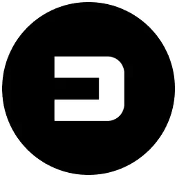

[__DDD__](https://www.facebook.com/dddstudy) \
 A club where developers and designers work together on side projects. \
`#south-korea`, `#design`, `#develop`

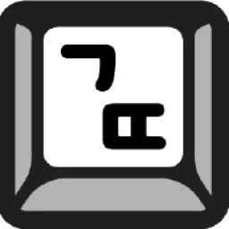

[__Geultto__](https://zzsza.notion.site/ac5b18a482fb4df497d4e8257ad4d516) \
 A group of developers who write blog articles. \
`#south-korea`, `#it`, `#blog`

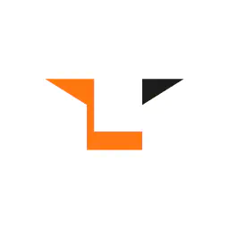

[__LIKELION__](https://likelion.net/) \
 An university startup joint club. \
`#south-korea`, `#university`, `#web`

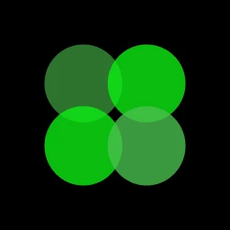

[__Pirogramming__](https://pirogramming.com/) \
 A web programming club for university students who did not major in computer science. \
`#south-korea`, `#university`, `#web`

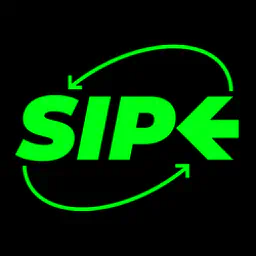

[__SIPE__](https://sipe.team/) \
 An IT community where developers in the field participate to learn and communicate. \
`#south-korea`, `#it`, `#study`

## Community Programs

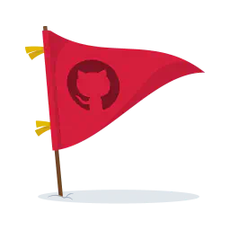

[__GitHub Campus Experts__](https://education.github.com/experts) \
 A program for student leaders who build diverse and inclusive spaces to learn skills, share experiences, and build projects. \
`#global`, `#github`, `#university`

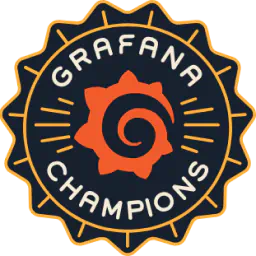

[__Grafana Champion__](https://grafana.com/community/champions/) \
 A program celebrates community experts, amplifies contributions and fosters a partnership with the Grafana team. \
`#global`, `#grafana`

---

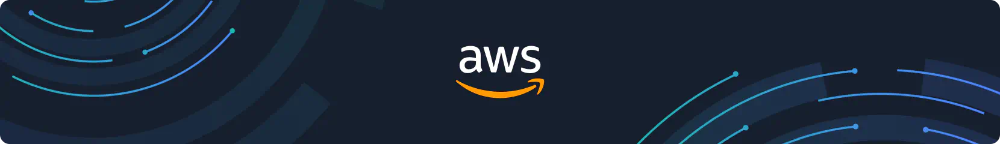

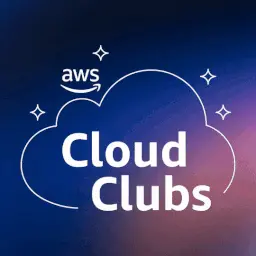

[__AWS Cloud Clubs__](https://aws.amazon.com/developer/community/students/cloudclubs/) \
 The student-led user groups for post-secondary level students and independent learners. \
`#global`, `#aws`, `#university`

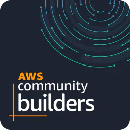

[__AWS Community Builders__](https://aws.amazon.com/developer/community/community-builders/) \
 A program designed to recognize and support individuals passionate about AWS and dedicated to AWS community. \
`#global`, `#aws`

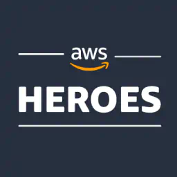

[__AWS Heroes__](https://aws.amazon.com/developer/community/heroes/) \
 A program recognizes a vibrant, worldwide group of AWS experts whose enthusiasm for knowledge-sharing has a real impact within the community. \
`#global`, `#aws`

---

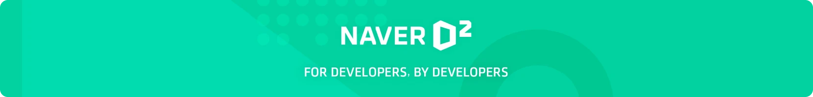

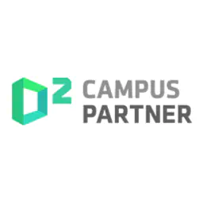

[__D2 Campus Partner__](https://d2.naver.com/program) \
 Supports clubs, groups, academic societies, seminars, and conferences to share development knowledge. \
`#south-korea`, `#naver`, `#university`

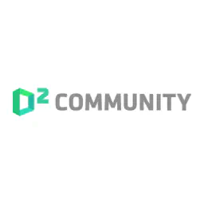

[__D2 Community__](https://d2.naver.com/program/community) \
 Supports developer community activities and help the results created in the community to be easily shared. \
`#south-korea`, `#naver`

---

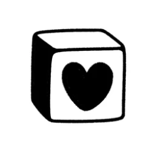

[__Notion Ambassadors__](https://www.notion.so/Notion-Ambassadors-40c3b3ee8c744e7fad34ab4ac9765773) \
 Notion Ambassadors are passionate, volunteer enthusiasts who teach and share Notion with others. \
`#global`, `#notion`

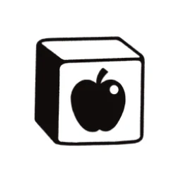

[__Notion Campus Leaders__](https://www.notion.so/Notion-Campus-Leaders-Program-5817b00cbaa244bca9e0e498804cbab4) \
 Enables student leaders at universities to share + teach Notion effectively, and build strong campus communities. \
`#global`, `#notion`, `#university`

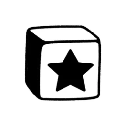

[__Notion Champions__](https://www.notion.so/Notion-Champions-20f977eb5fdd40d4a7a396f1742c3ea5) \
 Champions are the biggest Notion fans inside of companies. \
`#global`, `#notion`, `#enterprise`

---

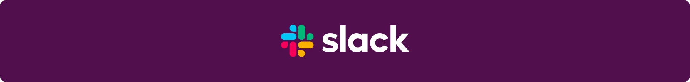

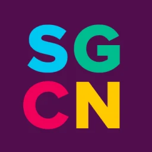

__Slack Champion Network__ \
 A community run by Slack that provides access to Slack teams and change management resources. \
`#global`, `#slack`, `#enterprise`

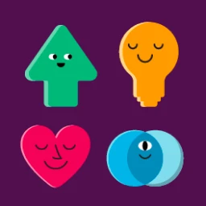

[__Slack Community__](https://slackcommunity.com/) \
 A global network of chapters run by dedicated volunteer organizers who are enthusiastic about Slack and want to share their experience and passion with others. \
`#global`, `#slack`

<!-- omit from toc -->
## Contributing

Contributions of any kind are always welcome through GitHub Issues and Pull Requests, just follow the [contributing guidelines](./CONTRIBUTING.md).

<!-- omit from toc -->
## License

Awesome Communities is licensed under [CC0 license](https://creativecommons.org/publicdomain/zero/1.0/), but the assets below are licensed separately.

- [GoCommunity](https://github.com/ashleymcnamara/gophers/blob/master/GoCommunity.png) by [Ashley Willis](https://github.com/ashleymcnamara) is licensed under [CC BY 4.0](http://creativecommons.org/licenses/by/4.0/)
- [Tossface](https://emojipedia.org/toss-face) by Viva Republica is licensed under [Tossface License](https://toss.im/tossface/copyright)
